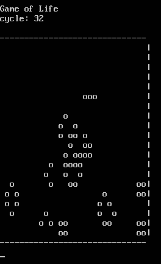

# Conway's Game of Life

## Rules:
* Any live cell with less than two live neighbours dies.
* Any live cell with two or three live neighbours livess on.
* Any live cell with more than three live neighbours dies.
* Any dead cell with exactly three live neighbours becomes a live cell.

## Image:
