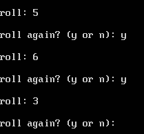
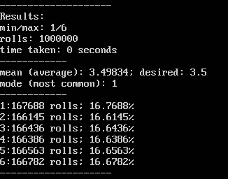

# Dice Roller

### Settings
* number_dice
* dice_max
* dice_min
* mode

### Features
* run single dice and print value (user roll mode)
	- ask_roll
* run many times and review data (distribution mode)
	- run_number
	- display_dist
	- display_rolls

## Image (normal roll mode):

## Image (distribution mode):
