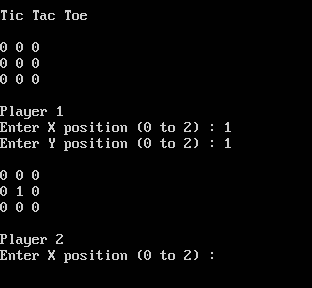

# Tic Tac Toe - Game

## Features:
* tracks both players on board.
* able to determine when someone wins.

## How To Play:
* X is the horizontal axis.
* Y is the vertical axis.
* enter intended movement space (x,y) in field.
* example space: top left is (0,0). bottom left is (0,2).

## Image:
